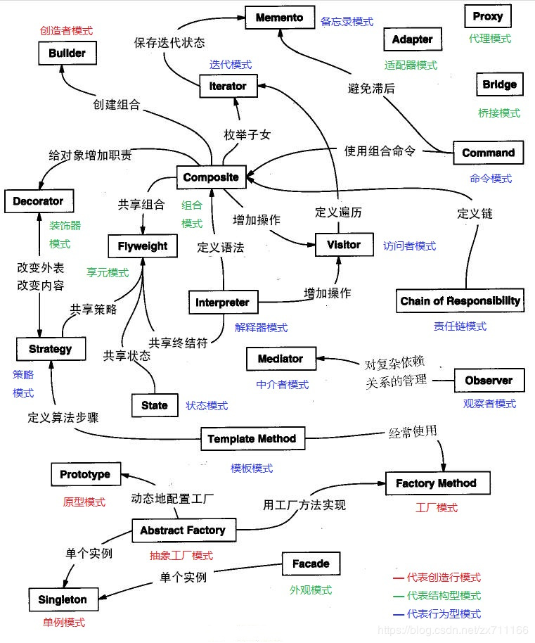

# design-pattern-learning

GoF 设计模式demo

## 设计模式分类

### 创建型模式

该类设计模式提供了一种在创建对象的同时隐藏创建逻辑的方式，而不是使用 new 运算符直接实例化对象。这使得程序在判断针对某个给定实例需要创建那些对象时更加灵活。

- 工厂模式（Factory Pattern）
- 抽象工厂模式（Abstract Factory Pattern）
- 单例模式（Singleton Pattern）
- 创造者模式（Builder Pattern）
- 原型模式（Prototype Pattern）

### 结构型模式

该类设计模式关注类和对象的组合。继承的改良被用来组合接口和定义组合对象获得新功能的方式。

- 适配器模式（Adapter Pattern）
- 桥接模式（Bridge Pattern）
- 过滤器模式（Filter、Criteria Pattern）
- 组合模式（Composite Pattern）
- 装饰器模式（Decorater Pattern）
- 外观模式（Facade Pattern）
- 享元模式（Flyweight Pattern）
- 代理模式（Proxy Pattern）

### 行为型模式

该设计模式特别关注对象之间的通信。

- 责任链模式（Chain of Responsibility Pattern）
- 命令模式（Command Pattern）
- 解释器模式（Interpreter Pattern）
- 迭代器模式（Iterator Pattern）
- 中介者模式（Mediator Pattern）
- 备忘录模式（Memento Pattern）
- 观察者模式（Observer Pattern）
- 状态模式（State Pattern）
- 空对象模式（Null Object Pattern）
- 策略模式（Strategy Pattern）
- 模板模式（Template Pattern）
- 访问者模式（Visitor Pattern）

### 常见模式关系  

## 参考资料  
- [Java 设计模式详解 — 简介](http://www.manongjc.com/article/34801.html)
- [Runoob设计模式教程](https://www.runoob.com/design-pattern/)